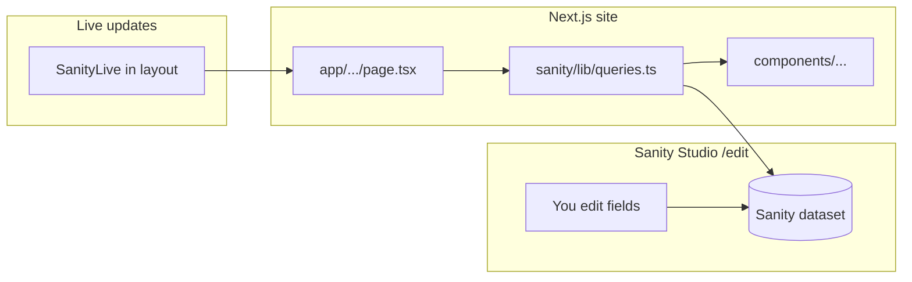

# Photon — Sister handoff: prototype the remaining pages

## What this is

A build order and copy map for prototyping every **Phase 1** page that is not the homepage yet. All approved words live in one file — do not invent new copy.

**Copy source of truth:** [`docs/2026-04-10-photon-website-copy-v3.md`](../2026-04-10-photon-website-copy-v3.md)  
**Status (from that doc):** v3 — round 2 feedback applied, ready for launch copy lock (2026-05-17)

**Visual direction:** [`brand-identity/design.json`](../../brand-identity/design.json) + [`docs/plans/2026-06-01-homepage-copy-visual-direction.md`](2026-06-01-homepage-copy-visual-direction.md)

**Dev server:** `npm run dev` → http://localhost:4000  
**CMS:** http://localhost:4000/edit

---

## Where to find copy for every page

**One markdown file has all approved words.** Open it in the repo or in Cursor:

| File                                                                                   | What it is                                                                                              |
| -------------------------------------------------------------------------------------- | ------------------------------------------------------------------------------------------------------- |
| [`docs/2026-04-10-photon-website-copy-v3.md`](../2026-04-10-photon-website-copy-v3.md) | **The copy bible** — every headline, paragraph, button, form label, SEO title, and 404 line for Phase 1 |

Use the section numbers in that file like a table of contents:

| Public URL                            | Copy in v3                         | Where to paste it in Sanity (`/edit`)                                                    |
| ------------------------------------- | ---------------------------------- | ---------------------------------------------------------------------------------------- |
| `/` (homepage)                        | §02 + §01 (SEO, footer)            | **Core Pages → Home** + **Settings → Site Settings** (footer, nav)                       |
| `/work`                               | §03 (index header + SEO)           | **Core Pages → Work**                                                                    |
| `/work/sportswear` … `/work/art-dept` | §03 (one block per category)       | **Dynamic Content → Work Categories** (10 docs)                                          |
| `/projects/[slug]`                    | §04 (standard) or §05 (case study) | **Dynamic Content → Projects** — per-project body is `[PLACEHOLDER]` until Liam provides |
| `/studio`                             | §06                                | **Core Pages → Studio**                                                                  |
| `/capabilities`                       | §07                                | **Core Pages → Capabilities**                                                            |
| `/rentals`                            | §08 (hub)                          | **Core Pages → Rentals → Hub**                                                           |
| `/rentals/studio`                     | §08 (`/rentals/studio`)            | **Core Pages → Rentals → Studio rental**                                                 |
| `/rentals/podcast`                    | §08 (`/rentals/podcast`)           | **Core Pages → Rentals → Podcast rental**                                                |
| `/rentals/gear`                       | §08 (`/rentals/gear`)              | **Core Pages → Rentals → Gear rental**                                                   |
| `/contact`                            | §09                                | **Core Pages → Contact**                                                                 |
| 404 (any bad URL)                     | §10                                | **Core Pages → Signal Lost (404)**                                                       |
| `/legal/terms`                        | §13                                | **Dynamic Content → Legal Pages**                                                        |
| Nav, footer, CTAs (every page)        | §01                                | **Settings → Site Settings**                                                             |

**Supporting docs (not the live copy, but useful context):**

| File                                                                                                      | Use when                                           |
| --------------------------------------------------------------------------------------------------------- | -------------------------------------------------- |
| [`docs/plans/2026-06-01-homepage-copy-visual-direction.md`](2026-06-01-homepage-copy-visual-direction.md) | Homepage layout + visual specs (pairs with v3 §02) |
| [`docs/plans/2026-05-17-photon-copy-v3-r2-edits.md`](2026-05-17-photon-copy-v3-r2-edits.md)               | What Liam already signed off in round 2            |
| [`brand-identity/strategy.json`](../../brand-identity/strategy.json)                                      | Why each page exists (strategy, not wording)       |

**Copy that is intentionally NOT in the v3 markdown** (do not hunt for it there):

- Per-project descriptions → Google Sheet (§11) — import later
- Capabilities module tile labels → Google Sheet tab 3
- Privacy / Cookies / Accessibility → not written yet

---

## Sanity — how to use it on this project

Sanity is the **content admin** for the site. You edit words, images, and project data in the Studio; the Next.js site reads that data and renders pages.

### Open the Studio

1. In the project folder, run `npm run dev` (or ask Cursor to run `qrestart`).
2. Go to **http://localhost:4000/edit** — this is Photon's CMS, not the public site.
3. Log in with the Sanity account Gabriella shared (OAuth on first visit).

The public site is **http://localhost:4000** — what visitors see. The Studio is **http://localhost:4000/edit** — what editors use.

### Studio sidebar (where things live)

The left nav in `/edit` is organized in `sanity/plugins/deskStructure.tsx`:

| Sidebar section     | What's inside                                                                  | How many                                                                        |
| ------------------- | ------------------------------------------------------------------------------ | ------------------------------------------------------------------------------- |
| **Core Pages**      | Home, Work, Capabilities, Studio, Contact, Rentals (hub + 3 rental pages), 404 | One doc each — **singletons** (you edit the page, you don't "create a new one") |
| **Dynamic Content** | Projects, Work Categories, Team, Legal Pages                                   | Many docs — one per project, category, crew member, legal page                  |
| **Settings**        | Site Settings (nav, footer), Developer Settings (analytics — dev only)         | Singletons                                                                      |

**Singleton rule:** Core Pages and Settings are fixed. You will never see a "Create new Home" button — you open **Home** and fill in fields.

**Rental pages** use fixed document IDs: `rental-studio`, `rental-podcast`, `rental-gear` — slugs should be `studio`, `podcast`, `gear` so URLs match `/rentals/studio`, etc.

### Editing workflow

1. **Open the document** in the sidebar (e.g. Core Pages → Contact).
2. **Use the tabs/groups** at the top of the editor — fields are grouped (SEO, Hero, Crew, etc.). Each field has a **description** under it explaining what it's for.
3. **Paste copy from v3** into the matching field. Field names in Studio roughly match v3 labels (e.g. `headline` = H1, `lead` = lead paragraph, `seoTitle` = `[SEO]` title).
4. **Publish** — top-right **Publish** button. Until you publish, the live site may show old or empty content (draft mode is different — see below).
5. **Refresh the public site** — changes appear after publish; live preview can update faster when Presentation is wired.

### Images and media

- Open **Media** in the Studio (plugin) to upload/browse assets.
- Before uploading, skim [`brand-identity/asset-tagging-strategy.md`](../../brand-identity/asset-tagging-strategy.md) — Photon uses a strict tag convention (`type-`, `color-`, `use-`, `style-`).
- Image fields ask for **alt text** — required for accessibility; describe what's in the photo.

### Draft mode & Presentation (preview while editing)

For developers / power users:

- **Presentation tool** in Studio opens the real site URL with overlays — click text on the preview to jump to that field in the CMS.
- **Draft mode** lets you preview unpublished changes. Enabled via Studio preview, not something editors need daily.

If the public page looks empty but Studio has content, check: (1) did you **Publish**? (2) does the **Next.js route exist yet**? (several pages still 404 until routes are built — see Current state).

---

## How Sanity integrates with the website

You do **not** need to understand all of this to paste copy — but it explains why some pages 404 and what Cursor/dev needs to wire up.



### The pipeline (3 layers)

| Layer                 | Path                                 | Role                                                                   |
| --------------------- | ------------------------------------ | ---------------------------------------------------------------------- |
| **Schema**            | `sanity/schemas/`                    | Defines which fields exist in Studio (headline, lead, spec rows, etc.) |
| **Query**             | `sanity/lib/queries.ts`              | GROQ queries that fetch those fields for each page                     |
| **Route + component** | `app/(personal)/...` + `components/` | Renders the data on the public URL                                     |

**Integration rule for this project:** Pages must use `sanityFetch` (from `sanity/lib/live.ts`), not raw API calls — that wires live updates and draft preview.

### URL → query mapping (already in the repo)

| URL                | Query name              | Sanity document type |
| ------------------ | ----------------------- | -------------------- |
| `/`                | `homePageQuery`         | `home`               |
| `/work`            | `workPageQuery`         | `workPage`           |
| `/capabilities`    | `capabilitiesPageQuery` | `capabilitiesPage`   |
| `/studio`          | `studioPageQuery`       | `studioPage`         |
| `/contact`         | `contactPageQuery`      | `contactPage`        |
| `/rentals`         | `rentalsHubQuery`       | `rentalsHub`         |
| `/rentals/[slug]`  | `rentalPageBySlugQuery` | `rentalPage`         |
| `/projects/[slug]` | `projectBySlugQuery`    | `project`            |
| `/legal/[slug]`    | `legalPageBySlugQuery`  | `legalPage`          |
| 404                | `notFoundPageQuery`     | `notFoundPage`       |

**What's missing today:** The queries exist, but several **routes** (`app/(personal)/work/page.tsx`, etc.) are not built yet — so Sanity content won't show until dev adds those files. Homepage (`app/(personal)/page.tsx`) is the working example to copy.

### What you own vs what dev owns

| You (content + design prototype)                  | Dev / Cursor (code)                                              |
| ------------------------------------------------- | ---------------------------------------------------------------- |
| Paste v3 copy into Studio fields                  | Create Next.js routes for `/work`, `/capabilities`, etc.         |
| Upload images, set alt text                       | Connect new fields to queries if schema changes                  |
| Order sections via `sectionOrder` where available | Build components that render `specRows`, crew grid, module tiles |
| Publish when copy is ready                        | Run `npm run typegen` after schema changes                       |
| Prototype layout in Figma or in code with Cursor  | Nav dropdown, Rentals routes, shared studio specs (§11 D6)       |

**Shared studio specs:** Studio page and `/rentals/studio` use the same spec table in v3. Dev should use one Sanity source so a spec edit updates both pages — flag this if you see duplicate spec fields.

### Presentation resolver (for preview links)

`sanity/plugins/resolve.ts` maps Studio preview URLs to documents — e.g. `/capabilities` → `capabilitiesPage`. When routes go live, "Open preview" in Studio should land on the correct page.

---

## Learning Sanity with Cursor

Cursor is your tutor. Keep this plan open and **ask in plain language** — point it at files in this repo so it doesn't guess.

### Setup prompts (run once)

```
How do I log into Sanity Studio for this project? What env vars do I need in .env.local?
```

```
Walk me through the Studio sidebar: what is a singleton vs a document in photon-old?
```

Use `.env.example` as the template; Gabriella provides real tokens in `.env.local` (never commit that file).

### Copy-paste prompts (per page)

When filling a page, open v3 to the right § and ask:

```
I'm editing Core Pages → Contact in Sanity. Map every field in contactPage schema to the exact copy in docs/2026-04-10-photon-website-copy-v3.md §09. List field name → paste value. Skip [bracket] notes.
```

```
Same for Studio — schema studioPage, copy v3 §06.
```

```
Same for Capabilities — schema capabilitiesPage, copy v3 §07.
```

### Integration prompts (when the site doesn't match Studio)

```
I published Contact in Sanity but /contact 404s. What's missing in app/ and sanity/lib/queries.ts for this project?
```

```
Show me how the homepage loads Sanity data — trace from app/(personal)/page.tsx to the component.
```

```
Add a Next.js route for /studio that uses studioPageQuery and renders the sections from Sanity. Match existing patterns in this repo.
```

### Sanity-specific "how do I…" prompts

```
How do I publish a change so it appears on localhost:4000?
```

```
Where do I upload crew portraits and how do I link them to Studio page crew section?
```

```
How do work filter pills work — workCategory documents vs workPage?
```

### What to tell Cursor **not** to do

- **Do not** ask it to write new marketing copy — say "use only v3 §07 verbatim."
- **Do not** hand-edit `sanity.types.ts` or `schema.json` — if schemas change, run `npm run typegen`.
- **Do not** commit `.env.local`.

### Repo files Cursor should read (reference paths)

| Topic                        | File                                                              |
| ---------------------------- | ----------------------------------------------------------------- |
| Sanity conventions           | `sanity/CLAUDE.md`                                                |
| App routing patterns         | `app/CLAUDE.md`                                                   |
| All queries                  | `sanity/lib/queries.ts`                                           |
| Studio desk layout           | `sanity/plugins/deskStructure.tsx`                                |
| URL helpers                  | `sanity/lib/utils.ts` → `resolveHref`                             |
| Homepage integration example | `app/(personal)/page.tsx` → `components/HomePage.tsx`             |
| Schema field definitions     | `sanity/schemas/singletons/*.ts`, `sanity/schemas/documents/*.ts` |

### Suggested first session (30 min)

1. Open v3 §01 and §02 side-by-side with **Core Pages → Home** and **Settings → Site Settings**.
2. Paste homepage SEO + philosophy + client roster + relationship proof lines.
3. Publish Home; refresh `/` and confirm what changed.
4. Ask Cursor: _"What's still hardcoded in VideoHero instead of coming from Sanity homePageQuery?"_
5. Repeat for **Contact** (§09) so the bottom CTA has somewhere real to link once the route exists.

---

## Current state (honest)

| Area                                         | Status                                                                                                                                                                                                                                        |
| -------------------------------------------- | --------------------------------------------------------------------------------------------------------------------------------------------------------------------------------------------------------------------------------------------- |
| Homepage (`/`)                               | **Partial prototype** — full-screen video carousel works (`VideoHero.tsx`). Still missing v3 homepage copy (client roster, philosophy line, relationship proof). Nav still shows **Archives** (dropped in v3) and links are `#` placeholders. |
| Work, Capabilities, Studio, Contact, Rentals | **Schemas + Sanity queries exist. No Next.js routes yet.** Visiting `/work` etc. will 404 today.                                                                                                                                              |
| Project pages (`/projects/[slug]`)           | Route exists; needs v3 template + CMS content                                                                                                                                                                                                 |
| 404                                          | Route exists (`app/not-found.tsx`); copy in v3 §10                                                                                                                                                                                            |
| Legal                                        | Routes exist; Terms body in v3 §13; Privacy/Cookies/Accessibility still TBD                                                                                                                                                                   |
| Archives, Press, Community, Portugal         | **Out of scope** — dropped or Phase 2                                                                                                                                                                                                         |

**Rule for prototyping:** Paste copy verbatim from v3. Strip anything in `[brackets]` — those are editor notes, not live text.

---

## What is final copy vs still open

### Use as-is (locked in v3)

| Section                                                   | v3 reference |
| --------------------------------------------------------- | ------------ |
| Nav, footer, CTAs                                         | §01          |
| Homepage philosophy, client strip, relationship line, SEO | §02          |
| Work index + all 10 category pages                        | §03          |
| Studio page                                               | §06          |
| Capabilities page (prose sections)                        | §07          |
| Rentals hub + studio + podcast + gear                     | §08          |
| Contact form + states                                     | §09          |
| 404                                                       | §10          |
| Terms                                                     | §13          |

### Not final — do not invent; use placeholders or skip

| Item                                                     | Owner                             | v3 note                                  |
| -------------------------------------------------------- | --------------------------------- | ---------------------------------------- |
| Per-project descriptions (homepage hero + project pages) | Liam / Photon                     | `[PLACEHOLDER]` in §02, §04–§05          |
| Testimonials on 5 hero case studies                      | Liam                              | §11 — TBD                                |
| Footwear + Studio category meta descriptions             | Liam                              | §12 — still open                         |
| Podcast mic models in spec table                         | Liam                              | §11                                      |
| Capabilities module tile labels (full grid)              | Google Sheet tab 3 → Sanity later | §07 — deferred                           |
| Gear + studio PDF links                                  | Liam                              | §08 — placeholder URLs until files exist |
| Privacy / Cookies / Accessibility                        | Liam / SALT                       | §11 — not in v3                          |
| Project grid data (titles, tags, years)                  | Google Sheet → Sanity             | §11 — Phase 2 import                     |

If a field is open, label it `[TBC]` in the prototype or leave the CMS field empty — **do not write substitute marketing copy.**

---

## Recommended build order

Prototype in this sequence. Each step unlocks nav links and realistic user flows.

### Phase A — Finish homepage chrome (1 day)

**Goal:** Homepage matches v3 §02 + §01 before building inner pages.

| Task                      | Copy        | Notes                                                                                                                |
| ------------------------- | ----------- | -------------------------------------------------------------------------------------------------------------------- |
| Fix top nav               | §01         | Work · Capabilities · Studio · Rentals · Contact. **Remove Archives.** Rentals = dropdown → Studio / Podcast / Gear. |
| Bottom CTA                | §01         | `Start a conversation →` → `/contact`                                                                                |
| Philosophy line           | §02         | `Think of us as mission control for your visual content.`                                                            |
| Client roster strip       | §02         | Full `SELECTED CLIENTS — Nike · Adidas · …` line                                                                     |
| Relationship proof        | §02         | `We measure clients in projects and years, not deliverables. The longest is five years in.`                          |
| SEO fields in Sanity Home | §02 `[SEO]` | Title, meta description, hidden H1 — all use **6,000 sq ft** (not 5,000)                                             |

**Files likely touched:** `components/VideoHero.tsx`, `sanity` Home singleton content at `/edit`

---

### Phase B — Standard page shell (0.5 day)

**Goal:** One reusable layout for “light mode” text pages (Capabilities, Studio, Contact, Rentals).

| Task                                                           | Reference                                                   |
| -------------------------------------------------------------- | ----------------------------------------------------------- |
| Dark mission-black chrome for Work + homepage                  | `design.json` — cinematic layer                             |
| Light/readable body for Capabilities, Studio, Contact, Rentals | `design.json` — “mode-shift” for text-heavy pages           |
| Reuse existing components where possible                       | `HeroSection`, `CTASection`, `ContactForm` in `components/` |

---

### Phase C — Core pages (in order)

#### 1. Contact — `/contact` (§09)

**Why first:** Every CTA on every other page routes here.

| Block                          | Copy                                |
| ------------------------------ | ----------------------------------- |
| Label                          | `05 — Contact`                      |
| H1                             | `Mission briefing.`                 |
| Lead                           | §09 lead paragraph                  |
| Direct email line              | chris@photon.studio                 |
| Form labels + dropdown options | §09 verbatim                        |
| Submit                         | `Launch →`                          |
| Success / error                | `Signal acquired.` / `Signal lost.` |
| Who you're reaching            | §09 small text                      |
| SEO                            | §09 `[SEO]`                         |

**Sanity:** `contactPage` singleton — query already exists (`contactPageQuery`).

---

#### 2. Studio — `/studio` (§06)

**Why before Capabilities:** Smaller page; validates spec table + crew grid pattern.

| Block        | Copy                                           |
| ------------ | ---------------------------------------------- |
| Label        | `02 — The studio`                              |
| H1           | `Ground Control for boots on the ground.`      |
| Lead         | §06 lead (6,000 sq ft)                         |
| Spec table   | §06 table — 13 rows                            |
| Lisbon block | `Satellite and EU launchpad.` + body           |
| Crew         | §06 names/titles — 2 large + 5 small portraits |
| CTA          | `Let's talk shop.` + `Start a conversation →`  |
| SEO          | §06 `[SEO]`                                    |

**Sanity:** `studioPage` + `teamMember` documents.

**Assets needed:** Crew portraits (Dropbox — §11). Use gray placeholders until photos arrive.

---

#### 3. Capabilities — `/capabilities` (§07)

**Largest static page.**

| Block                        | Copy                                                                                           |
| ---------------------------- | ---------------------------------------------------------------------------------------------- |
| Hero                         | Label `03 — Capabilities`, H1, lead, founder anchor, secondary line                            |
| Why modular                  | Subhead + body                                                                                 |
| How we work                  | Subhead + body                                                                                 |
| Where we work                | Subhead + body                                                                                 |
| Module tiles                 | §07 tile list — **labels from sheet later**; for prototype use the list in v3 as static labels |
| Creative / Production / Post | Each: subhead, intro line, body                                                                |
| Agencies & brands            | Subhead, body, optional pull-quote                                                             |
| CTA                          | `Need a specific capability on a specific date?`                                               |
| SEO                          | §07 `[SEO]`                                                                                    |

**Sanity:** `capabilitiesPage` singleton.

---

#### 4. Rentals — `/rentals`, `/rentals/studio`, `/rentals/podcast`, `/rentals/gear` (§08)

| Route                     | v3 section                                                 |
| ------------------------- | ---------------------------------------------------------- |
| `/rentals` (optional hub) | Hub H1, lead, three cards                                  |
| `/rentals/studio`         | Studio rental — specs, included/extra, CTA                 |
| `/rentals/podcast`        | Podcast room — specs, `[TBC]` mic models OK as placeholder |
| `/rentals/gear`           | Gear list + PDF placeholder links                          |

**Shared block:** “Good to know” paragraph (booking rules) — can repeat on studio + podcast.

**Nav:** Single **Rentals** item with dropdown (§01).

**Sanity:** `rentalsHub` + three `rentalPage` documents (`studio`, `podcast`, `gear` slugs).

**Dev note:** Studio specs should share one Sanity source with Studio page (§11 D6).

---

#### 5. Work — `/work` + `/work/[category]` (§03)

| Piece                  | Copy                                                   |
| ---------------------- | ------------------------------------------------------ |
| Index label/H1/subhead | `01 — Selected work` / `All Projects` / filter subhead |
| Filter pills           | 10 categories — all ship at launch (R2)                |
| Empty state            | §03                                                    |
| Per-category headers   | §03 — each `/work/*` block                             |
| Card format            | Title, client, year, tags — **from CMS, not v3 prose** |
| SEO per category       | §03 meta blocks                                        |

**Open meta only:** Footwear + Studio — use v1 drafts from §03 until Liam confirms (§12).

**Sanity:** `workPage` singleton + `workCategory` documents + `project` documents.

**Prototype without full CMS:** Hardcode 6–8 placeholder cards using real project names from the sheet if available; do not write fake descriptions on cards.

---

#### 6. Project pages — `/projects/[slug]` (§04–§05)

Two templates:

| Template   | When                              | v3 section |
| ---------- | --------------------------------- | ---------- |
| Standard   | Most projects                     | §04        |
| Case study | Sorel, Nike, Hyperice, Oura, etc. | §05        |

**Copy that's final:** Section labels, CTA labels, structure.  
**Copy that's not:** Per-project body — `[PLACEHOLDER]` until Liam provides.

---

#### 7. System pages

| Page   | Copy | Route                                          |
| ------ | ---- | ---------------------------------------------- |
| 404    | §10  | Already wired — populate Sanity `notFoundPage` |
| Terms  | §13  | `/legal/terms` (or equivalent slug)            |
| Footer | §01  | Portland address, hello@, socials              |

---

## Per-page copy cheat sheet (paste-ready)

These are the **headlines only** — full paragraphs stay in v3.

| Page           | Label                   | H1                                        |
| -------------- | ----------------------- | ----------------------------------------- |
| Work           | `01 — Selected work`    | `All Projects`                            |
| Studio         | `02 — The studio`       | `Ground Control for boots on the ground.` |
| Capabilities   | `03 — Capabilities`     | `Modular Production, beginning to end.`   |
| Rentals hub    | `04 — Rentals`          | `Space and gear available for creators.`  |
| Studio rental  | `04.1 — Studio rental`  | `Portland Studio.`                        |
| Podcast rental | `04.2 — Podcast rental` | `Portland Podcast Room.`                  |
| Gear rental    | `04.3 — Gear rental`    | `Gear list.`                              |
| Contact        | `05 — Contact`          | `Mission briefing.`                       |
| 404            | —                       | `Signal lost.`                            |

Category H1s = category name (Sportswear, Lifestyle, Tech, …) — see §03.

---

## Sanity population checklist

After each page is prototyped, paste the matching v3 section into the Studio singleton at `/edit`:

1. **Home** — §02 + §01 SEO/footer fields
2. **Settings** — menu items, footer, social links (§01)
3. **Work Page** — §03 index copy
4. **Work Categories** (×10) — §03 per-category blocks
5. **Capabilities** — §07
6. **Studio** — §06 + crew refs
7. **Rentals Hub** — §08 hub
8. **Rental Pages** (×3) — §08 subpages
9. **Contact** — §09
10. **Not Found** — §10
11. **Legal → Terms** — §13

---

## What to skip entirely

- **Archives** — removed in v2 (§00 changelog)
- **Press / Community / Portugal** — Phase 2 (`brand-identity/strategy.json`)
- **Logo grid with “Trusted by”** — replaced by client roster line (§02)
- **Writing new project descriptions** — wait for Liam / sheet import

---

## Definition of done (prototype)

- [ ] All Phase 1 routes render without 404
- [ ] Nav matches v3 §01 (5 items, Rentals dropdown, no Archives)
- [ ] Every visible string traceable to v3 § section (or marked `[TBC]`)
- [ ] CTAs route to `/contact` (or correct rental prefill where specified)
- [ ] 6,000 sq ft consistent anywhere specs appear
- [ ] Light/dark mode split matches `design.json` intent
- [ ] Open items listed in §12 documented as placeholders, not hidden

---

## If stuck

| Question                          | Where to look                                                                              |
| --------------------------------- | ------------------------------------------------------------------------------------------ |
| **Where is the copy for page X?** | [Where to find copy for every page](#where-to-find-copy-for-every-page) → v3 § table       |
| Exact wording                     | `docs/2026-04-10-photon-website-copy-v3.md`                                                |
| Which Studio doc to open          | Sidebar map in [Sanity — how to use it](#sanity--how-to-use-it-on-this-project)            |
| Why publish didn't show on site   | [How Sanity integrates](#how-sanity-integrates-with-the-website) — route may not exist yet |
| Teach me / wire this up           | [Learning Sanity with Cursor](#learning-sanity-with-cursor) — copy the prompts             |
| Why a page exists                 | `brand-identity/strategy.json` → `sitemap.pages`                                           |
| Colors, type, spacing             | `/brand` on dev server + `brand-identity/design.json`                                      |
| What Liam already approved        | `docs/plans/2026-05-17-photon-copy-v3-r2-edits.md`                                         |
| Schema field names                | `sanity/schemas/singletons/` + field descriptions in `/edit`                               |

---

## Next step after prototype

1. Liam reviews v3 MD + live prototype (silence = approval per §00)
2. Close §12 open items (meta, testimonials, PDFs, photos)
3. Sheet → Sanity for projects + capabilities tiles (§11 Phase 2)
4. Wire remaining Next.js routes if not done during prototype
